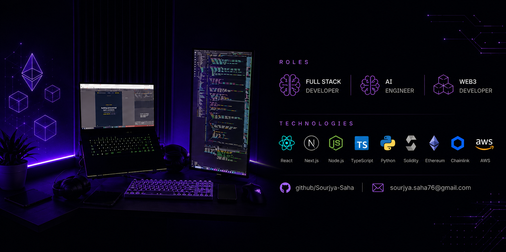

# Hey! I'm Sourjya Saha

### Software Developer | AI Engineer | Full-Stack Dev | Web3 Dev

I’m a **Software Developer** who enjoys turning ideas into software that actually works. 
I build across **AI, full-stack development, and Web3**, with a particular interest in 
**AI agents, intelligent systems, and decentralized products**.

Currently pursuing **Information Technology at Heritage Institute of Technology**, 
while spending most of my time building, experimenting, breaking things, and figuring 
out how to make them better.

### Achievements

🏆 **Smart India Hackathon 2025 — Winner**  
🏆 **SIH HackHeritage 2024 — Winner**  

I believe the best way to learn software is to **build it, break it, and build it better.**

## About Me

- Building AI-powered applications and intelligent agents
- Developing scalable full-stack web applications
- Exploring Web3, smart contracts, and decentralized systems
- Contributing to open-source projects and participating in hackathons
- Constantly learning and experimenting with new technologies

## What I'm Working On

- AI agents and agentic workflows
- Full-stack applications with modern web technologies
- Web3 applications and smart contracts
- Projects that combine AI with decentralized technologies

## Connect With Me

## Tech Stack

**Languages**

**Frontend**

**Backend**

**Databases & Data**

**AI & GenAI**

**Blockchain & Web3**

**Cloud & DevOps**

**Tools**

## GitHub Stats

  

## GitHub Activity

<picture>
  <source media="(prefers-color-scheme: dark)" srcset="https://raw.githubusercontent.com/Sourjya-Saha/Sourjya-Saha/output/github-snake-dark.svg" />
  <source media="(prefers-color-scheme: light)" srcset="https://raw.githubusercontent.com/Sourjya-Saha/Sourjya-Saha/output/github-snake.svg" />
  
</picture>

---
